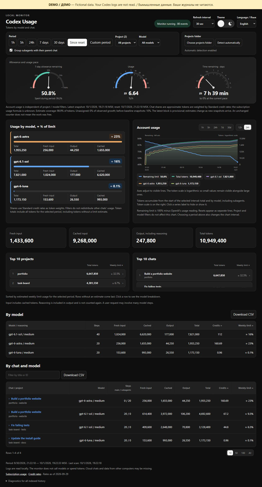

# Track Your Codex — Codex Usage & Token Tracker

See which Codex chats, projects and models use the most tokens. Runs on your computer with Python; no extra packages or API keys.

[Русский](README.ru.md) · [Download](https://github.com/plankapkan/track-your-codex/releases/latest) · [Report a problem](https://github.com/plankapkan/track-your-codex/issues)



[Light theme](docs/images/dashboard-en-light-2026-10-01.jpg)

## Run

Requires Python 3.10+ and local Codex logs. Run terminal commands from the project folder. Download and extract the release ZIP, or clone:

```sh
git clone https://github.com/plankapkan/track-your-codex.git
cd track-your-codex
```

Run `python start.py` on Windows, or `python3 start.py` on macOS / Linux. The dashboard opens in your browser. Keep the terminal open; stop with Ctrl+C. Use `--no-browser` to open [localhost:8766](http://127.0.0.1:8766/) yourself. A quoted absolute path to `start.py` also works from another folder.

Automated tests run on all three platforms; the browser interface has been checked manually on Windows.

**Try with example data:** run `python -m token_tracker.demo` (`python3 -m token_tracker.demo` on macOS / Linux). It opens a separate dashboard without reading your Codex logs. Stop with Ctrl+C.

Upgrading from v0.2.0? Follow the [migration steps](docs/troubleshooting.md#upgrading-from-v020).

## What it shows

- Tokens by chat, project and model, with input, cache and output counts.
- Weekly allowance snapshots, token charts and subagent grouping.
- Three gauges in one panel: remaining weekly allowance (0–100%), usage pace (%/hour) and time remaining (0–7 days). The pace and time gauges use nonlinear scales to make small values easier to read; allowance spent during the selected period appears below the remaining allowance.
- Filters, chat search and CSV export. English / Russian; light / dark theme.

## About the numbers

Account percentages come from snapshots in local logs. Shares marked **≈** are estimates weighted by credit rates, not official subscription charges. Cloud chats and other devices may be missing. Times currently use Moscow time (UTC+3).

The pace estimate uses the last three hours of account readings, with more weight on recent data and observed pauses included. Time remaining assumes that pace continues; it is not an official forecast. Stale readings, gaps, resets and insufficient changes suppress the estimate. If the allowance resets before the projected 0%, the gauge says so. The usage dial has a red zone at 40–100 %/hour; the time dial caps its needle at 7 days while keeping the full duration in the number.

The monitor runs on `127.0.0.1`, reads Codex's database without changing it and never reads `auth.json`. It makes no model calls. Its local database stores counters and chat metadata, not message text.

[Troubleshooting](docs/troubleshooting.md) · [Development](docs/development.md) · [Accounting details (Russian)](docs/accounting.md) · [MIT license](LICENSE)
