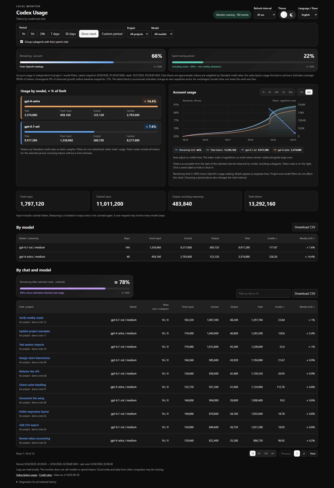

# Track Your Codex — Codex Usage & Token Tracker

See which Codex chats, projects and models use the most tokens. Runs on your computer with Python; no extra packages or API keys.

[Русский](README.ru.md) · [Download](https://github.com/plankapkan/track-your-codex/releases/latest) · [Report a problem](https://github.com/plankapkan/track-your-codex/issues)



## Run

Requires Python 3.10+ and local Codex logs. Download and extract the release ZIP, or clone:

```sh
git clone https://github.com/plankapkan/track-your-codex.git
cd track-your-codex
```

**Windows:** double-click `Start-monitor.cmd`. Stop with `Stop-monitor.cmd`. The launcher also works with Codex's bundled Python.

**macOS / Linux:** run `python3 monitor.py`, then open [localhost:8766](http://127.0.0.1:8766/). Stop with Ctrl+C. These platforms have not yet been verified.

**Try with example data:** run `python demo.py` (`python3 demo.py` on macOS / Linux). It opens a separate dashboard without reading your Codex logs. Stop with Ctrl+C.

## What it shows

- Tokens by chat, project and model, with input, cache and output counts.
- Weekly allowance snapshots, token charts and subagent grouping.
- Filters, chat search and CSV export. English / Russian; light / dark theme.

## About the numbers

Account percentages come from snapshots in local logs. Shares marked **≈** are estimates weighted by credit rates, not official subscription charges. Cloud chats and other devices may be missing. Times currently use Moscow time (UTC+3).

The monitor runs on `127.0.0.1`, reads Codex's database without changing it and never reads `auth.json`. It makes no model calls. Its local database stores counters and chat metadata, not message text.

[Troubleshooting](docs/troubleshooting.md) · [Accounting details (Russian)](docs/accounting.md) · [MIT license](LICENSE)
