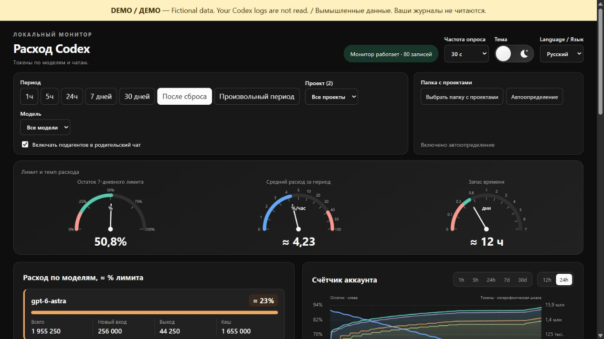

# Track Your Codex

Показывает расход токенов Codex по чатам, проектам и моделям. Работает на вашем компьютере. Нужен Python 3.10+; дополнительные пакеты и API-ключи не нужны.

[English](README.md) · [Скачать](https://github.com/plankapkan/track-your-codex/releases/latest) · [Сообщить о проблеме](https://github.com/plankapkan/track-your-codex/issues)

[Светлая тема](docs/images/dashboard-ru-light-2026-10-02.png)

## Запуск

Скачайте ZIP из релиза и распакуйте. Команды терминала выполняйте из папки проекта.

Выполните `python start.py` на Windows или `python3 start.py` на macOS / Linux. Страница откроется в браузере. Оставьте терминал открытым; остановка — Ctrl+C. С флагом `--no-browser` откройте [localhost:8766](http://127.0.0.1:8766/) самостоятельно. Можно запускать и из другой папки, указав полный путь к `start.py` в кавычках.

Автотесты проходят на всех трёх системах; интерфейс вручную проверен на Windows.

**Демо без своих журналов:** `python -m token_tracker.demo` (на macOS / Linux — `python3 -m token_tracker.demo`). Откроется отдельная страница с вымышленными данными. Остановка — Ctrl+C.

Обновление с v0.2.0: [как перенести данные](docs/troubleshooting.md#обновление-с-v020).

## Возможности

- Токены по чатам, проектам и моделям: новый вход, кеш и выход.
- Снимки недельного лимита, графики и группировка подагентов.
- Три стрелочных прибора в одной панели: остаток недельного лимита (0–100%), темп расхода (%/час) и запас времени (0–7 дней). Неравномерные шкалы темпа и времени помогают различать небольшие значения; единицы расположены внутри циферблатов, под приборами оставлены только числа, а подробности доступны при наведении. Между секциями и соседними карточками — единый отступ 16 пикселей.
- Топ-10 чатов виден целиком без прокрутки внутри списка. Проект вынесен в отдельную колонку, строки однострочные; полные сокращённые названия доступны при наведении. Нажмите на строку для разбивки по моделям.
- Фильтры, поиск и CSV. Русский / английский, светлая / тёмная тема.

## Данные

Процент аккаунта берётся из локальных снимков OpenAI. Доли со знаком **≈** — оценка по весам кредитных тарифов, а не официальное списание подписки. Облачные чаты и другие компьютеры могут отсутствовать. Время — Москва (UTC+3).

Темп учитывает выбранный диапазон: наблюдаемый прирост расхода лимита делится на время наблюдений. Усреднение по времени сглаживает короткие пики и учитывает паузы; частые снимки не получают лишнего веса. Пробелы более 30 минут, сбросы и понижения не соединяются, отсутствие истории не считается нулевым расходом. Покрытие наблюдениями доступно в подсказке прибора. Фильтры проекта и модели не меняют общий темп аккаунта.

Запас времени предполагает сохранение среднего темпа выбранного периода; это не официальный прогноз. Историческое среднее сохраняется при устаревшем снимке, но прогноз требует свежего остатка аккаунта. При недостатке времени наблюдений или прироста темп скрывается. Если лимит сбросится раньше прогнозируемого 0%, это указано в подсказке. Красная зона расхода — 40–100 %/час. Стрелка запаса времени ограничена 7 днями, а число показывает полную длительность.

Монитор работает на `127.0.0.1`, не меняет базу Codex, не читает `auth.json` и не обращается к моделям. Сохраняет локально счётчики и сведения о чатах, без текстов сообщений.

[Если не запускается](docs/troubleshooting.md) · [Разработка (English)](docs/development.md) · [Как считаются данные](docs/accounting.md) · [Лицензия MIT](LICENSE)
