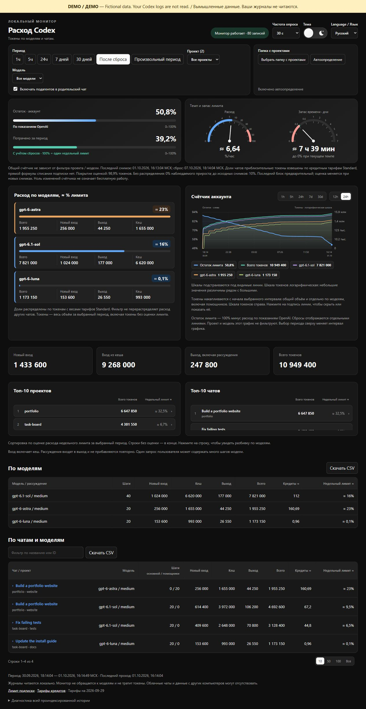

# Track Your Codex

Показывает расход токенов Codex по чатам, проектам и моделям. Работает на вашем компьютере. Нужен Python 3.10+; дополнительные пакеты и API-ключи не нужны.

[English](README.md) · [Скачать](https://github.com/plankapkan/track-your-codex/releases/latest) · [Сообщить о проблеме](https://github.com/plankapkan/track-your-codex/issues)

[Светлая тема](docs/images/dashboard-ru-light-2026-10-01.jpg)

## Запуск

Скачайте ZIP из релиза и распакуйте. Команды терминала выполняйте из папки проекта.

Выполните `python start.py` на Windows или `python3 start.py` на macOS / Linux. Страница откроется в браузере. Оставьте терминал открытым; остановка — Ctrl+C. С флагом `--no-browser` откройте [localhost:8766](http://127.0.0.1:8766/) самостоятельно. Можно запускать и из другой папки, указав полный путь к `start.py` в кавычках.

Автотесты проходят на всех трёх системах; интерфейс вручную проверен на Windows.

**Демо без своих журналов:** `python -m token_tracker.demo` (на macOS / Linux — `python3 -m token_tracker.demo`). Откроется отдельная страница с вымышленными данными. Остановка — Ctrl+C.

Обновление с v0.2.0: [как перенести данные](docs/troubleshooting.md#обновление-с-v020).

## Возможности

- Токены по чатам, проектам и моделям: новый вход, кеш и выход.
- Снимки недельного лимита, графики и группировка подагентов.
- Остаток и расход за период двумя полосками в одной карточке, спидометр расхода в %/час и прибор запаса времени на 0–7 дней. Неравномерные шкалы помогают различать небольшие значения.
- Фильтры, поиск и CSV. Русский / английский, светлая / тёмная тема.

## Данные

Процент аккаунта берётся из локальных снимков OpenAI. Доли со знаком **≈** — оценка по весам кредитных тарифов, а не официальное списание подписки. Облачные чаты и другие компьютеры могут отсутствовать. Время — Москва (UTC+3).

Темп оценивается по последним трём часам показаний аккаунта с большим весом свежих данных и учётом наблюдаемых пауз. Запас времени предполагает сохранение этого темпа; это не официальный прогноз. При устаревших снимках, пробелах, сбросах и недостаточном приросте оценка скрывается. Если лимит сбросится раньше прогнозируемого 0%, прибор сообщает об этом. Красная зона расхода — 40–100 %/час. Стрелка запаса времени ограничена 7 днями, а число показывает полную длительность.

Монитор работает на `127.0.0.1`, не меняет базу Codex, не читает `auth.json` и не обращается к моделям. Сохраняет локально счётчики и сведения о чатах, без текстов сообщений.

[Если не запускается](docs/troubleshooting.md) · [Разработка (English)](docs/development.md) · [Как считаются данные](docs/accounting.md) · [Лицензия MIT](LICENSE)
